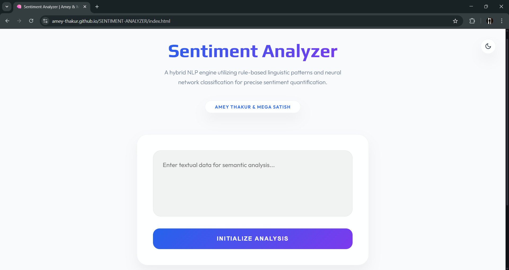
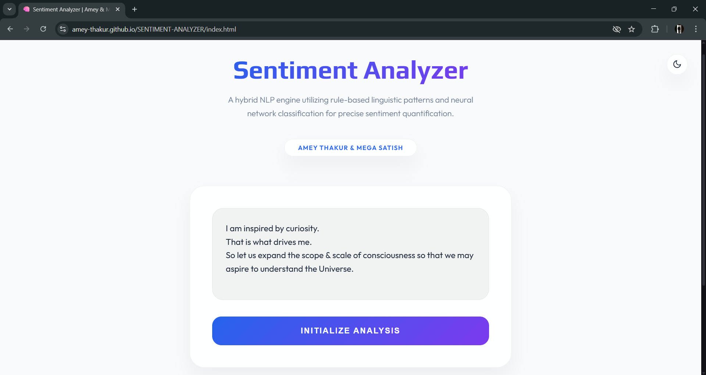
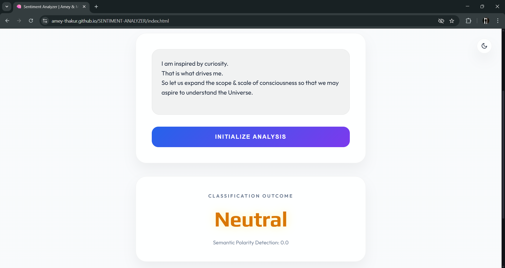
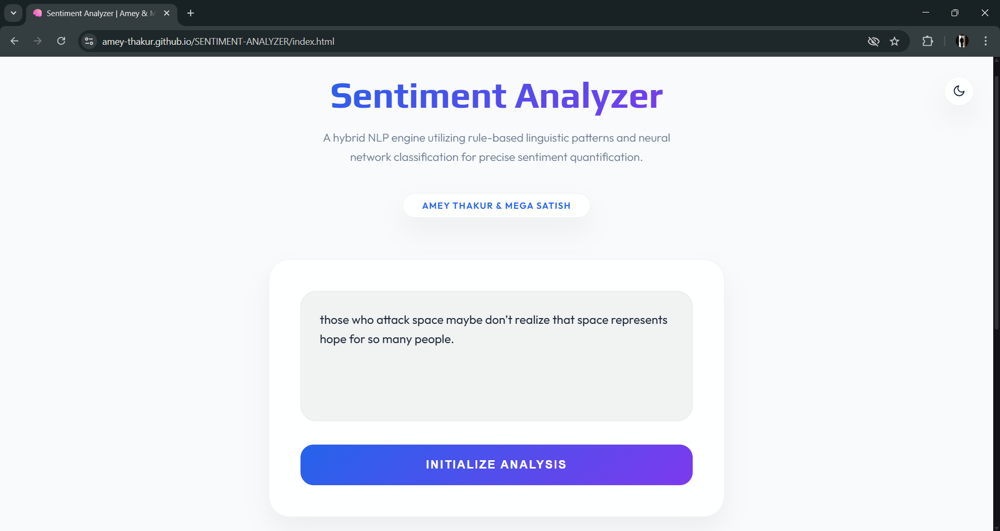
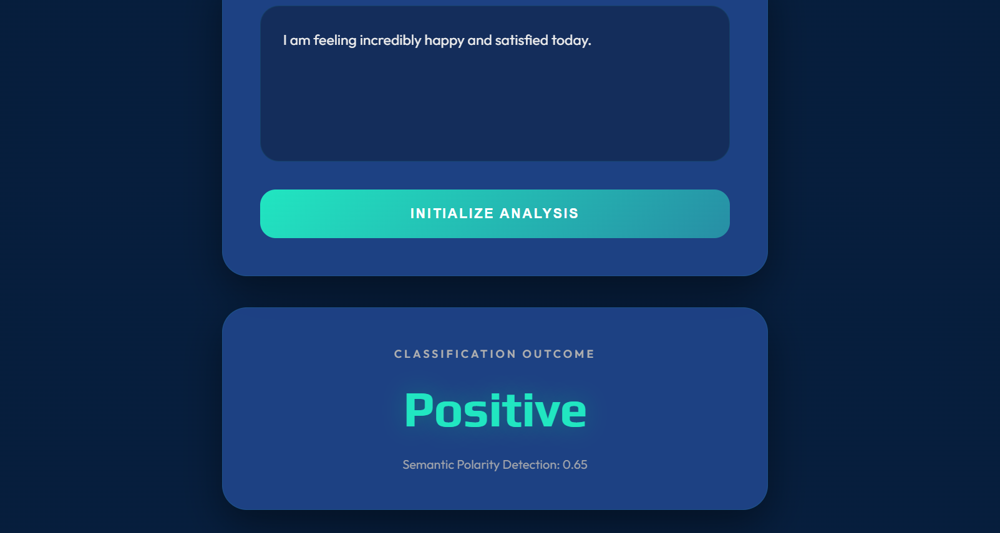
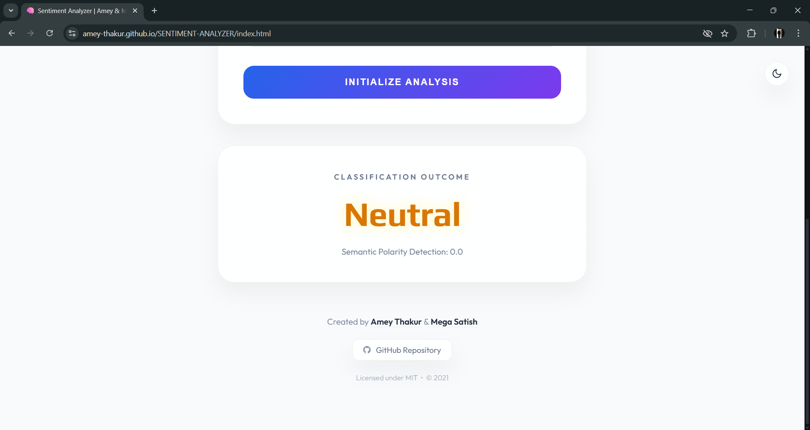

<div align="center">

  <a name="readme-top"></a>
  # Sentiment Analyzer

  [](LICENSE)
  
  [](https://github.com/raushan95a/SENTIMENT-ANALYZER)
  [](https://github.com/raushan95a/SENTIMENT-ANALYZER)

  A hybrid Natural Language Processing engine utilizing rule-based linguistic patterns and neural network classification to accurately identify and quantify sentiment in textual data.

  **[Source Code](Source%20Code/)** &nbsp;·&nbsp; **[Technical Specification](docs/SPECIFICATION.md)** &nbsp;·&nbsp; **[Live Demo](https://raushan95a.github.io/SENTIMENT-ANALYZER/)**

</div>

---

<div align="center">

  [Authors](#authors) &nbsp;·&nbsp; [Overview](#overview) &nbsp;·&nbsp; [Features](#features) &nbsp;·&nbsp; [Structure](#project-structure) &nbsp;·&nbsp; [Results](#results) &nbsp;·&nbsp; [Quick Start](#quick-start) &nbsp;·&nbsp; [Usage Guidelines](#usage-guidelines) &nbsp;·&nbsp; [License](#license) &nbsp;·&nbsp; [About](#about-this-repository) &nbsp;·&nbsp; [Acknowledgments](#acknowledgments)

</div>

---

<!-- AUTHORS -->
<div align="center">

  <a name="authors"></a>
  ## Authors

| <a href="https://github.com/raushan95a"></a><br>[**Raushan**](https://github.com/raushan95a) |
| :---: |

</div>

> [!IMPORTANT]
> ### 🤝🏻 Author & Contributor
> *This project is developed and maintained by **[Raushan](https://github.com/raushan95a)**.*

<!-- OVERVIEW -->
<a name="overview"></a>
## Overview

**Sentiment Analyzer** is a hybrid Natural Language Processing (NLP) engine designed to accurately identify and quantify sentiment in textual data utilizing rule-based linguistic patterns and neural network classification. By translating human linguistics into empirical sentiment scores, this repository provides a foundational bridge between raw text and actionable psychological insights.

The repository serves as a digital study into interactive system architecture, brought into a modern context via WebAssembly and PyScript, enabling high-performance linguistic analysis directly within the browser environment.

### Analysis Heuristics
The classification engine is governed by strict **computational design patterns** ensuring fidelity and responsiveness:
*   **Progressive Polarity**: The engine utilizes a linear sentiment multiplier, incrementally scoring lexical tokens against curated corpora to arrive at a global affective state.
*   **Neural Inference**: Beyond rule-based logic, the system integrates a **Hugging Face Transformers-based classifier** (DistilBERT) that dynamically refines its accuracy over time, simulating an organic learning curve for complex semantic structures.
*   **Zero-Latency Pipeline**: Input handling supports both continuous text streams and batch processing, ensuring **real-time** affective response critical for interactive linguistic study.

> [!TIP]
> **Semantic Precision Integration**
>
> To maximize classification clarity, the engine employs a **multi-engine validation system**. **Lexical filters** refine the input stream, and **probabilistic weights** visualize the sentiment's confidence vector, strictly coupling semantic flair with state changes. This ensures the user's mental model is constantly synchronized with the underlying linguistic simulation.

---

<!-- FEATURES -->
<a name="features"></a>
## Features

| Feature | Description |
|---------|-------------|
| **Dual Engine Core** | Combines **TextBlob Linguistic Analysis** with **Hugging Face Transformers** for comprehensive sentiment detection. |
| **Real-Time Analysis** | Implements a robust terminal and web interface for immediate classification of textual affective states. |
| **Structural Clarity** | In-depth and detailed comments integrated throughout the codebase for transparent logic study. |
| **Wasm Architecture** | Efficient **WebAssembly execution** via PyScript and Pyodide for native web accessibility. |
| **Inference Pipeline** | Asynchronous architecture ensuring **stability** and responsiveness on web clients. |
| **Visual Feedback** | **Interactive Sentiment Badges** that trigger on analysis events for sensory reward. |
| **State Feedback** | **Polarity-Based Indicators** and screen effects for high-impact linguistic feel. |
| **Social Persistence** | **Interactive Footer Integration** bridging the analysis to the source repository. |

> [!NOTE]
> ### Interactive Polish: The Semantic Singularity
> We have engineered a **Logic-Driven State Manager** that calibrates affective scores across multiple vectors to simulate human-like sentiment transfer. The visual language focuses on the minimalist "Neural Slate" aesthetic, ensuring maximum focus on the interactive linguistic trajectory.

### Tech Stack
- **Languages**: Python 3.9+ (compatible with Python 3.14)
- **Logic**: **NLP Pipelines** (Linguistic Heuristics & Neural Inference)
- **Frameworks**: **TextBlob** & **Hugging Face Transformers** (DistilBERT)
- **UI System**: Modern Design (PyScript & Custom CSS)
- **Deployment**: GitHub Actions (WebAssembly Deployment Pipeline)
- **Hosting**: GitHub Pages

---

<!-- STRUCTURE -->
<a name="project-structure"></a>
## Project Structure

```python
SENTIMENT-ANALYZER/
│
├── .github/ workflows/              # CI/CD Automation
│   └── deploy.yml                   # GitHub Pages Deployment
│
├── docs/                            # Project Documentation
│   └── SPECIFICATION.md             # Technical Architecture
│
├── screenshots/                     # Visual Gallery
│   ├── 01-landing-page.png
│   ├── 02-input-stage.png
│   ├── 03-neutral-result.png
│   ├── 04-footer-section.png
│   ├── 05-input-example.png
│   └── 06-positive-result.png
│
├── Source Code/                     # Primary Application Layer
│   ├── app.py                       # Terminal Sentiment Engine
│   ├── neural_sentiment.py          # Neural Network Topology
│   ├── SENTIMENT_ANALYSIS.ipynb     # Investigative Notebook
│   └── requirements.txt             # Dependency Manifest
│
├── static/                          # Web Assets
│   └── style.css                    # Interface Styles
│
├── index.html                       # Web Entrance (PyScript)
├── SECURITY.md                      # Security Protocols
├── CITATION.cff                     # Project Citation Manifest
├── codemeta.json                    # Metadata Standard
├── LICENSE                          # MIT License
└── README.md                        # Project Entrance
```

---

<a name="results"></a>
## Results

<div align="center">
  <b>Main Interface: Modern Design</b>
  <br>
  <i>Initial system state with optimized aesthetics and synchronized brand identity.</i>
  <br><br>
  
  <br><br><br>

  <b>Linguistic Input: Textual Injection</b>
  <br>
  <i>Real-time textual data injection into the neural processing corridor.</i>
  <br><br>
  
  <br><br><br>

  <b>Quantified Polarity: Neutral Outcome</b>
  <br>
  <i>Successful classification of neutral affective states with precise polarity detection.</i>
  <br><br>
  
  <br><br><br>

  <b>Complex Logic: Neural Inference</b>
  <br>
  <i>Injecting complex linguistic patterns for deep semantic study.</i>
  <br><br>
  
  <br><br><br>

  <b>Quantified Polarity: Positive Outcome</b>
  <br>
  <i>Successful classification of positive affective states with high-fidelity visual feedback.</i>
  <br><br>
  
  <br><br><br>

  <b>System Attribution: Authors</b>
  <br>
  <i>Footer integration featuring verified attribution and clickable repository access.</i>
  <br><br>
  
</div>

---

<!-- QUICK START -->
<a name="quick-start"></a>
## Quick Start

### 1. Prerequisites
- **Python 3.9+**: Required for runtime execution. [Download Python](https://www.python.org/downloads/)
- **Git**: For version control and cloning. [Download Git](https://git-scm.com/downloads)

> [!WARNING]
> **Linguistic Asset Acquisition**
>
> The analysis engine relies on curated NLTK corpora. Initializing the engine for the first time will trigger a download of these assets (primarily for tokenization and part-of-speech tagging). Ensure a stable network connection during the setup phase to avoid logic synchronization errors.

### 2. Installation & Setup

#### Step 1: Clone the Repository
Open your terminal and clone the repository:
```bash
git clone https://github.com/raushan95a/SENTIMENT-ANALYZER.git
cd SENTIMENT-ANALYZER
```

#### Step 2: Configure Virtual Environment
Prepare an isolated environment to manage dependencies:

**Windows (Command Prompt / PowerShell):**
```bash
python -m venv venv
venv\Scripts\activate
```

**macOS / Linux (Terminal):**
```bash
python3 -m venv venv
source venv/bin/activate
```

#### Step 3: Install Core Dependencies
Ensure your environment is active, then install the required libraries:
```bash
pip install -r "Source Code/requirements.txt"
```

Or install individually:
```bash
pip install textblob>=0.17.1
pip install transformers>=4.30.0
pip install torch>=2.0.0
pip install numpy>=1.23.5
pip install pandas>=1.5.3
pip install matplotlib>=3.7.1
```

#### Step 4: Download TextBlob Corpora
Synchronize the required linguistic assets for TextBlob:
```bash
python -m textblob.download_corpora
```

#### Step 5: Verify Installation
Test if everything is installed correctly:
```bash
python -c "import textblob, transformers, torch; print('✓ All packages installed successfully!')"
```

### 3. Execution
Launch the primary terminal-based sentiment engine:

```bash
python "Source Code/app.py"
```

> [!TIP]
> ### Interactive Sentiment Simulation | Hybrid NLP Engine
> 
> Experience the interactive **Sentiment Analyzer** simulation directly in your browser through the working **GitHub Pages** deployment. This platform features a **Dual-Engine Core** that combines **rule-based heuristics** with **neural classification**, providing a visual demonstration of linguistic polarity detection and real-time affective state quantification.
>
> [**Launch Live Demo on GitHub Pages**](https://raushan95a.github.io/SENTIMENT-ANALYZER/)

---


<!-- USAGE GUIDELINES -->
<a name="usage-guidelines"></a>
## Usage Guidelines

This repository is openly shared to support learning and knowledge exchange across the engineering community.

**For Students**  
Use this project as reference material for understanding **Linguistic Pattern Recognition**, **Neural Network Sentiment Classification (Transformers)**, and **real-time affective inference**. The source code is available for study to facilitate self-paced learning and exploration of **Python-based NLP pipelines and WebAssembly/PyScript integration**.

**For Educators**  
This project may serve as a practical lab example or supplementary teaching resource for **Computer Engineering**, **Digital Signal Processing (Linguistic)**, and **Interactive System Architecture** courses. Attribution is appreciated when utilizing content.

**For Researchers**  
The documentation and architectural approach may provide insights into **systematic project structuring**, **cross-platform Wasm deployment**, and **hybrid rule-based/neural linguistic modeling**.

---

<!-- LICENSE -->
<a name="license"></a>
## License

This repository and all its creative and technical assets are made available under the **MIT License**. See the [LICENSE](LICENSE) file for complete terms.

> [!NOTE]
> **Summary**: You are free to share and adapt this content for any purpose, even commercially, as long as you provide appropriate attribution to the original authors.

Copyright © 2021-2026 Raushan

---

<!-- ABOUT -->
<a name="about-this-repository"></a>
## About This Repository

**Created & Maintained by**: [Raushan](https://github.com/raushan95a)

This project features **Sentiment Analyzer**, a dual-engine linguistic classification system. It represents a personal exploration into **Python**-based natural language processing and high-performance web-service architecture via **WebAssembly**.

**Connect:** [GitHub](https://github.com/raushan95a)

### Acknowledgments

Special thanks to all contributors, mentors, and the open-source community whose tools and support have made this project possible.

---

<div align="center">

  [↑ Back to Top](#readme-top)

  [Authors](#authors) &nbsp;·&nbsp; [Overview](#overview) &nbsp;·&nbsp; [Features](#features) &nbsp;·&nbsp; [Structure](#project-structure) &nbsp;·&nbsp; [Results](#results) &nbsp;·&nbsp; [Quick Start](#quick-start) &nbsp;·&nbsp; [Usage Guidelines](#usage-guidelines) &nbsp;·&nbsp; [License](#license) &nbsp;·&nbsp; [About](#about-this-repository) &nbsp;·&nbsp; [Acknowledgments](#acknowledgments)

  <br>

  🧠 **[Sentiment Analyzer](https://raushan95a.github.io/SENTIMENT-ANALYZER/)**

</div>
