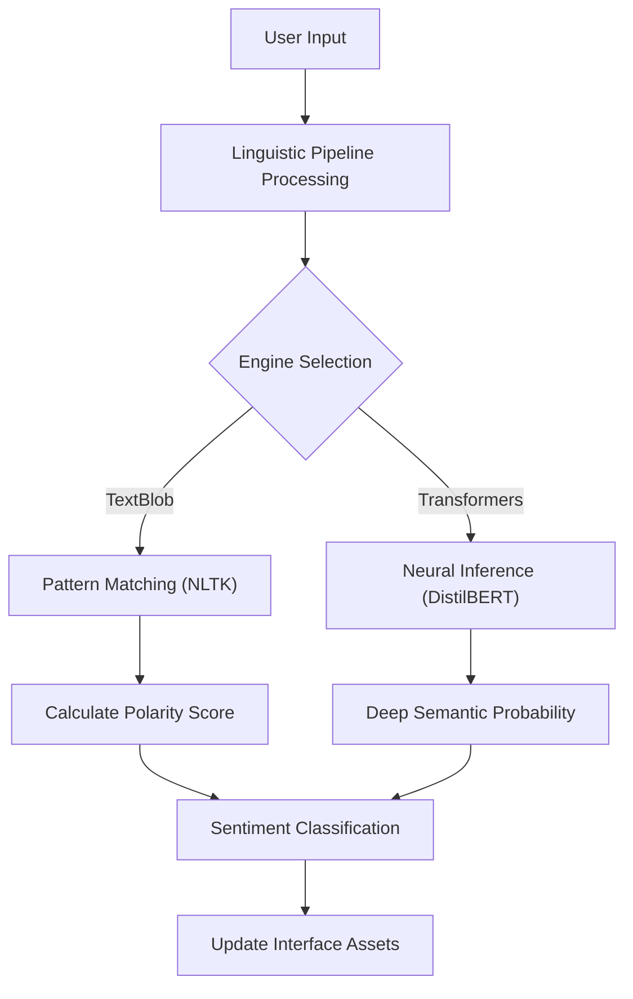

# Technical Specification: Sentiment Analyzer

## Architectural Overview

**Sentiment Analyzer** is a hybrid Natural Language Processing (NLP) architecture designed to identify and quantify sentiment in textual data utilizing rule-based linguistic patterns and neural network classification. The application serves as a digital study into NLP logic and inference performance, brought into a modern context via WebAssembly and PyScript.

### Analysis Logic Flow

---

## Technical Implementations

### 1. Engine Architecture
-   **Core Interface**: Built on **PyScript** and **Pyodide**, enabling the execution of Pythonic NLP logic natively within the browser environment.
-   **Neural Topology**: Implements a pre-trained DistilBERT model from Hugging Face Transformers for high-dimensional semantic extraction from balanced datasets.

### 2. Logic & Inference
-   **Affective Pattern Recognition**: Uses rule-based linguistic corpora via **TextBlob** to perform real-time sentiment polarity and subjectivity assessment.
-   **Hugging Face Transformers**: Provides a transition path from heuristic-driven logic to data-driven probabilistic classification using pre-trained DistilBERT for complex semantic structures.
-   **Semantic Pipeline**: Event-driven execution synchronized with input stream lifecycle events (Initialization, Analysis, Result).

### 3. Deployment Pipeline
-   **WebAssembly**: The project uses **Pyodide** to run the Python interpreter directly in the browser, allowing native execution of scientific libraries without a backend server.
-   **CI/CD**: **GitHub Actions** handles the deployment process, syncing static assets, styles, and scripts to **GitHub Pages**.

---

## Technical Prerequisites

-   **Runtime**: Modern WebAssembly-compliant browser (Chrome, Edge, Firefox).
-   **Development**: Python 3.9+ (compatible with Python 3.14) with `textblob` and `transformers` installed.

---

*Technical Specification | Python | Version 1.0*
